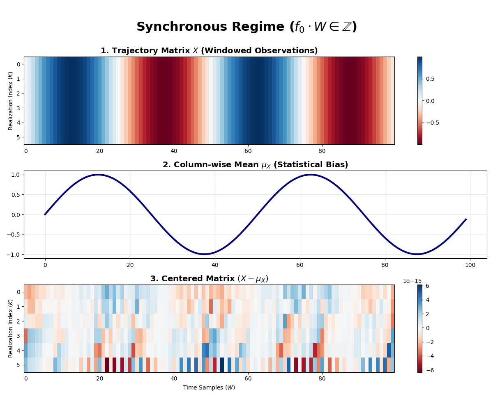
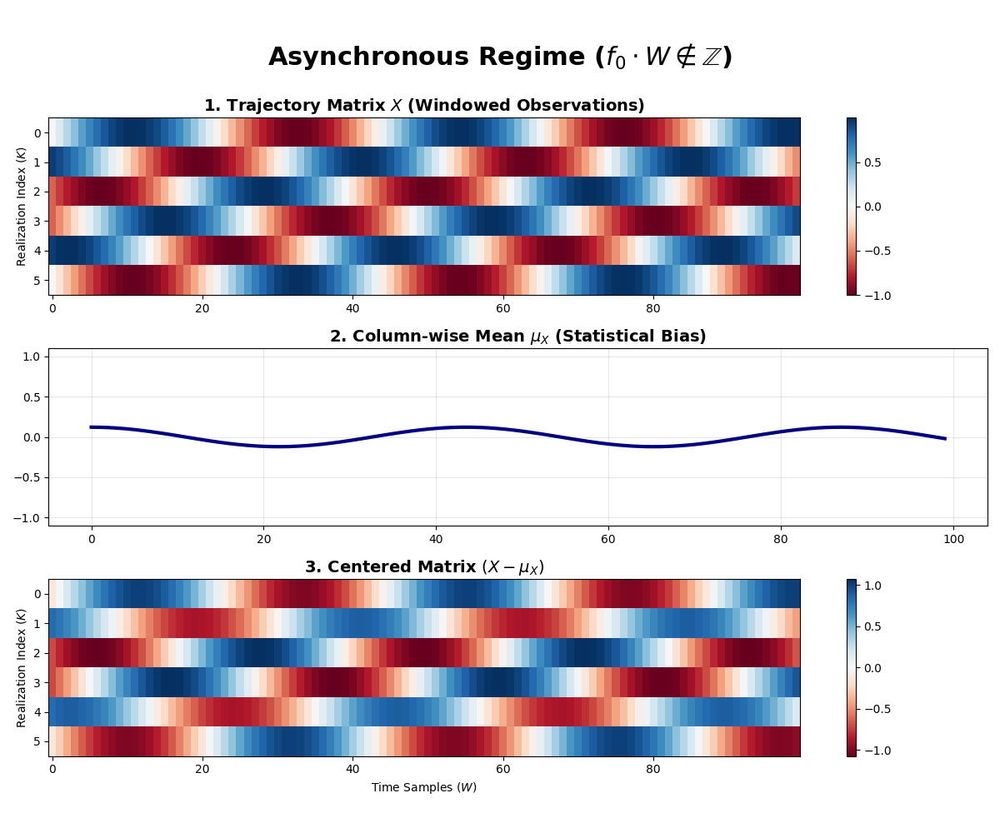

# Synthetic Signal Analysis & The Synchronous Phase Phenomenon

This directory contains notebooks dedicated to testing the Karhunen-Loève Transform (KLT) in a controlled environment. By using the `setigen` library, we generate synthetic radio frequency (RF) data, inject artificial continuous-wave (CW) signals at specific Signal-to-Noise Ratios (SNR), and evaluate the KLT's ability to extract them.

Beyond standard testing, this folder serves as an exploration of a fundamental mathematical challenge encountered when applying spatial decomposition techniques to time-series data: **The Synchronous Phase Phenomenon**.

---

## Theoretical Background

To understand the tests in this directory, it is helpful to understand how 1D time-series data is processed by the Covariance KLT (C-KLT).

### 1. From 1D to 2D: The Windowing Process
A radio telescope records a single, long 1D array of voltage samples over time. However, the KLT (like Principal Component Analysis, PCA) requires a 2D matrix (Observations $\times$ Variables) to compute a covariance matrix.

To solve this, the 1D voltage stream is segmented into consecutive blocks of length $W$ (the `WINDOW_SIZE`). These segments are stacked vertically to form the 2D **Trajectory Matrix** $X \in \mathbb{C}^{K \times W}$:
* **Rows ($K$):** Different time observations (Realizations).
* **Columns ($W$):** Time steps within a single window.

### 2. Centering the Data
To calculate the statistical **Covariance Matrix**, standard linear algebra requires the data to be "centered". This is done by calculating the mean of each column across all rows (the vector $\mu_X$), and subtracting this mean array from every row in the matrix:
```text
Centered_Matrix = Matrix - Column_Means
```

---

## The Synchronous Phase Problem

During our internship testing, we encountered a strange anomaly: when a very strong synthetic signal was injected at specific frequencies, the KLT completely failed to detect it. The dominant eigenvalue collapsed, and the reconstructed signal was just noise. Why?

The root cause lies in how continuous waves interact with the windowing process. We can demonstrate this mathematically.

### Mathematical Formulation
Consider an ideal, noiseless complex baseband signal representing a continuous wave (CW):

$$
x[n] = A e^{j(2\pi f_0 n + \phi)}
$$

When populating the $k$-th row of our Trajectory Matrix $X$, the absolute time index $n$ can be expressed as $n = k \cdot W + m$, where $W$ is the window size, $k \in [0, K-1]$ is the row index, and $m \in [0, W-1]$ is the column index. Substituting this into the signal equation, the elements of the $k$-th row become:

$$
X_{k,m} = A e^{j(2\pi f_0 (kW + m) + \phi)} = A e^{j(2\pi f_0 m + \phi)} \cdot e^{j(2\pi f_0 k W)}
$$

The term $e^{j(2\pi f_0 k W)}$ represents the **phase shift** of the signal between one row and the next. 

If the frequency $f_0$ perfectly aligns with the window size $W$, such that $f_0 \cdot W$ results in an **exact integer** (for instance, $f_0 = 0.25$ and $W = 1024$, yielding $256$), the phase shift exponential evaluates to $1$:

$$
e^{j(2\pi \cdot 256 \cdot k)} = 1
$$

This means that the signal restarts with the exact same phase at the beginning of every single row. For the deterministic signal component, **Row 1 is identical to Row 2, which is identical to Row 3, and so on.**

### The Trap of the Mean (Signal Erasure)
Because all rows are identical copies of the signal ($X_{k,m} = X_{0,m}$ for all $k$), the column-wise mean $\mu_X$ perfectly absorbs the transmission:

$$
\mu_X[m] = \frac{1}{K} \sum_{k=0}^{K-1} X_{k,m} = X_{0,m}
$$

When the algorithm performs the centering operation $(X - \mu_X)$, the signal is subtracted from itself, yielding exactly $0$. The resulting centered matrix contains only random thermal noise. The KLT models the noise, extracts the noise, and fails to see the signal. 

### Visualizing the Phenomenon


> **Figure 1 - Synchronous Regime:** The phase is perfectly aligned vertically across all realizations. The mean vector (blue) absorbs the continuous wave entirely, leaving the centered matrix devoid of any signal energy.


> **Figure 2 - Asynchronous Regime:** A fractional frequency offset forces the phase to rotate across realizations. The mean averages incoherently toward zero, preserving the continuous wave in the centered matrix for the KLT to extract.

---

## Temporary Solution: Fractional Offsets

To prevent the KLT from erasing the signal during the centering phase, we must ensure that the phase of the signal *rotates* from one row to the next ($e^{j(2\pi f_0 k W)} \neq 1$).

We achieve this by injecting our synthetic signals using a **fractional offset** relative to the frequency bins (e.g., `BASEBAND_OFFSET_FRAC = 0.3`). Because $0.3 \times W$ does not yield an integer, the signal's phase shifts slightly with every new row. Consequently, the column means destructively interfere and average to near-zero, leaving the pure signal safely inside the matrix for the KLT to discover.

---

## Notebook Overview

### `injected_signal.ipynb`
This is the main testing ground for synthetic data. In this notebook, you will see the theory put into practice:
1. **Generation:** We simulate a Polyphase Filterbank (PFB) output containing thermal noise and a weak CW signal.
2. **Injection Strategy:** We explicitly use fractional offsets (like `0.3`) to bypass the synchronous phase problem.
3. **Diagnostics:** We verify the signal's presence using a broadband power scan.
4. **KLT Application:** We run the C-KLT, extract the principal eigenvector, and plot the eigenspectrum, dynamic waterfall, and integrated Power Spectral Density (PSD) to measure the SNR improvement.